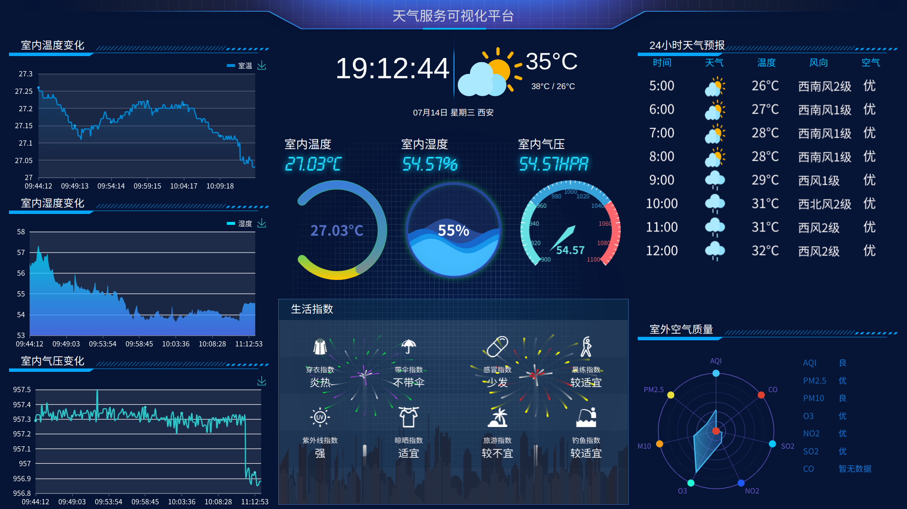

### 天气服务可视化平台
简介：这个是大三生产实习项目，内容是室内条件和室外天气可视化的Web服务。室内数据是用树莓派和传感器测得，室外数据是调用[天气API](https://www.tianqiapi.com/)获得。结构简单，功能较少，但前端做起来不太容易，属于入门级Web项目。

此前没做过Web项目，初次尝试举步维艰。
让我真正了解简单web项目的结构的是一个[疫情大数据web项目](https://blog.csdn.net/hxxjxw/article/details/105336981)及其[相关视频](https://www.bilibili.com/video/BV177411j7qJ)。

开发过程中参考了echarts官方[文档](https://echarts.apache.org/examples/zh/index.html)、网上的博客（多是针对开发过程中遇到的问题、bug），感谢！

边学习边开发真是件痛苦的事，最后做出来效果还可以，算是一次简单的项目经历。

效果如图


### 项目设计

#### 项目框架
Python+mysql+flask+echarts

#### 数据
- 数据库：mysql
- 室内数据：树莓派（每十秒上传一次）
    - 温度传感器
    - 湿度传感器
    - 气压传感器
- 室外数据：天气API
    - 实时天气（天气、温度）
    - 空气质量（空气质量指数、二氧化硫等气体指数）
    - 生活指数（生活提示等）
    - 天气预报（未来24小时天气预报）

#### 后端
- 语言：Python
- 数据库：mysql
- 框架：flask

#### 前端
- html, css, Javascript, jQuery, Echarts, Ajax

### Get Started

环境要求比较简单，见[requirement](./requirement.txt)

```sh
python ./app.py
```
若不想运行数据库或调用API的数据，把 app.py 里面的`LOCALDATA`设为`True`（默认值），即可从本地加载数据